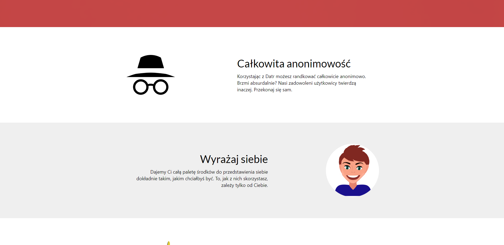
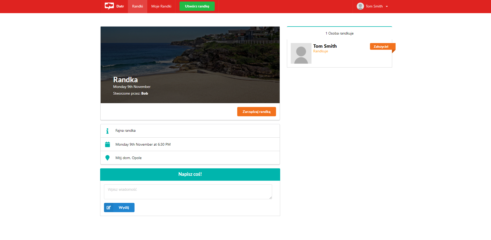

# Datr

A discontinued team project of a roleplay-dating app. 

## Screenshots





## Setup
On one console perform:
```
dotnet restore
dotnet user-secrets init -p API/
dotnet user-secrets set "TokenKey" "super secret key" -p API/
cd api
dotnet watch run
```

And on the second one:
```
cd client-app
npm install
npm start
```

You should end up with your browser opening up the app.

## Technologies
* .NET Core
* C#
* React
* Typescript
* CSS

## Features
* Creating accounts with full authentication
* Setting up dates
* Chatting
* Performing CRUD operations